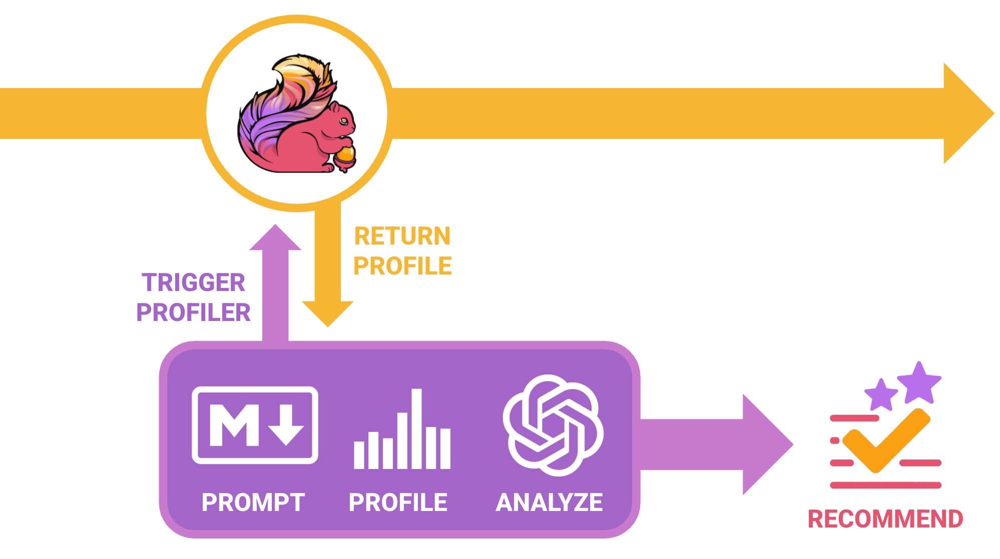

# Squirrly - AI-Boosted Profiling for Apache Flink on Kubernetes

Squirrly is currently a work in progress that aims to provide a pattern (or patterns) for leveraging the existing profiling mechanisms in conjunction with AI tooling to identify and address potential bottlenecks within running jobs.



## Overview

This project contains a minimal Flink streaming job that performs a series:
- Generates random integers (1-100) continuously
- Processes them through intentionally inefficient map functions (e.g., one with random `Thread.sleep()` operations)
- Writes the results to a DiscardingSink (for simplicity only)

To avoid an avalanche of scripts strewn about, the sample job is packaged and deployed to Kubernetes using the **Flink Kubernetes Operator** with a single command, making local development and infrastructure as minimal as possible (after all this is just a playground).

## Prerequisites

You will need a handful of tools installed on your machine (or available in the expected environment) before playing around, namely:

1. **Java 21** - Required for building and running the Flink job
   ```bash
   java -version
   ```
   
   **Note:** Make sure Maven is using Java 21. If you have multiple Java versions installed, you may need to set `JAVA_HOME`:
   ```bash
   export JAVA_HOME=$(/usr/libexec/java_home -v 21)
   mvn --version  
   ```

2. **Maven** - Build tool
   ```bash
   mvn --version
   ```

3. **Docker** - For building container images
   ```bash
   docker --version
   ```

4. **Minikube** - Local Kubernetes cluster
   ```bash
   minikube version
   ```

5. **kubectl** - Kubernetes command-line tool
   ```bash
   kubectl version --client
   ```

6. **Helm** - Package manager for Kubernetes (for installing Flink Kubernetes Operator)
   ```bash
   helm version
   ```
   **Note:** The deploy script will automatically install the Flink Kubernetes Operator if it's not already present.

## Installation

1. **Start Minikube** (optional - the deploy script will start it automatically if needed)
   ```bash
   minikube start
   ```

2. **Verify Minikube is running**
   ```bash
   minikube status
   ```

**Note:** The Flink Kubernetes Operator will be automatically installed by the deploy script if it's not already present in your cluster.

## Running the Job

To initially test things out and deploy the sample Flink job to your local Kubernetes, you just need to run the following command:

```bash
./scripts/deploy.sh
```

This script will:
1. Check for and install the Flink Kubernetes Operator (if needed)
2. Build the Kotlin Flink job
3. Build the Docker image with the JAR
4. Create the `squirrly` namespace in Kubernetes
5. Deploy the Flink application using a FlinkDeployment custom resource
6. Set up port forwarding for the Flink UI

The Flink Kubernetes Operator will automatically:
- Create and manage the Flink cluster (JobManager and TaskManager)
- Submit the Flink job
- Handle job lifecycle and resource management

After deploying, you should be able to access the Flink UI for the job running at:
- **http://localhost:8081**

## Project Structure

```
squirrly/
├── src/main/kotlin/dev/squirrly/
│   └── SimpleFlinkJob.kt                 # Main Flink streaming job
├── k8s/
│   ├── resources/                        # Shared infrastructure resources
│   │   ├── namespace.yaml                # Kubernetes namespace
│   │   ├── serviceaccount.yaml           # ServiceAccount (shared)
│   │   ├── role.yaml                     # Role (shared)
│   │   └── rolebinding.yaml              # RoleBinding (shared)
│   ├── sample-job/
│   │   └── flink-deployment.yaml        # FlinkDeployment custom resource
│   └── squirrly-profiler/
│       ├── job.yaml                      # Profiler Job
│       ├── profiler.sh                   # Profiler script source
│       ├── prompt.md                     # Analysis prompt (editable)
│       └── README.md                     # Profiler documentation
├── images/
│   └── squirrly-flow.png                # Flow diagram
├── pom.xml                               # Maven build configuration
├── Dockerfile                            # Docker image definition
├── scripts/
│   ├── deploy.sh                         # Deployment script
│   └── run-profiler.sh                   # Profiler runner script
└── README.md                             # (this file)
```

## Profiling

To run the profiler and trigger profiling on the Flink job:

```bash
./scripts/run-profiler.sh
```

This will:
1. Delete any existing profiler job
2. Create a new profiler job
3. Optionally follow the logs

The profiler will trigger the Flink profiler on the TaskManager and wait for it to complete. See `k8s/squirrly-profiler/README.md` for more details.

## Monitoring

Once deployed, you can monitor the Flink job through the **Flink Web UI** at http://localhost:8081.

### Checking FlinkDeployment Status

```bash
kubectl get flinkdeployment sample-job --namespace squirrly
kubectl describe flinkdeployment sample-job --namespace squirrly
```

## Cleanup

To remove the Flink application:

```bash
kubectl delete flinkdeployment sample-job --namespace squirrly
```

To remove all resources:

```bash
kubectl delete namespace squirrly
```

To remove the Flink Kubernetes Operator (if you installed it via the deploy script):

```bash
helm uninstall flink-kubernetes-operator --namespace flink-operator
kubectl delete namespace flink-operator
```

To stop minikube:

```bash
minikube stop
```


